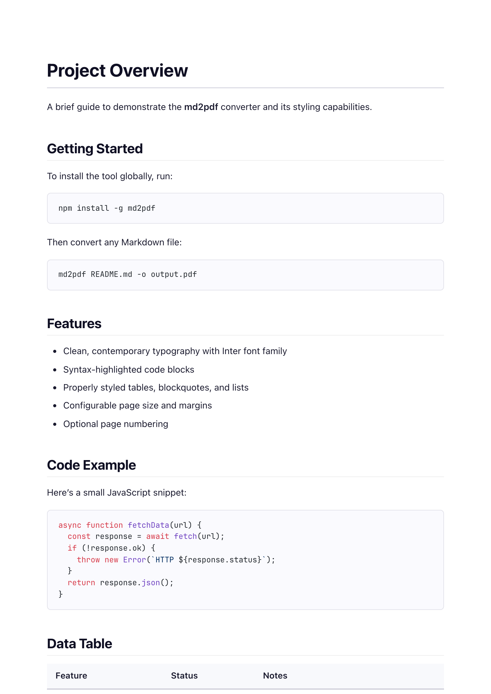
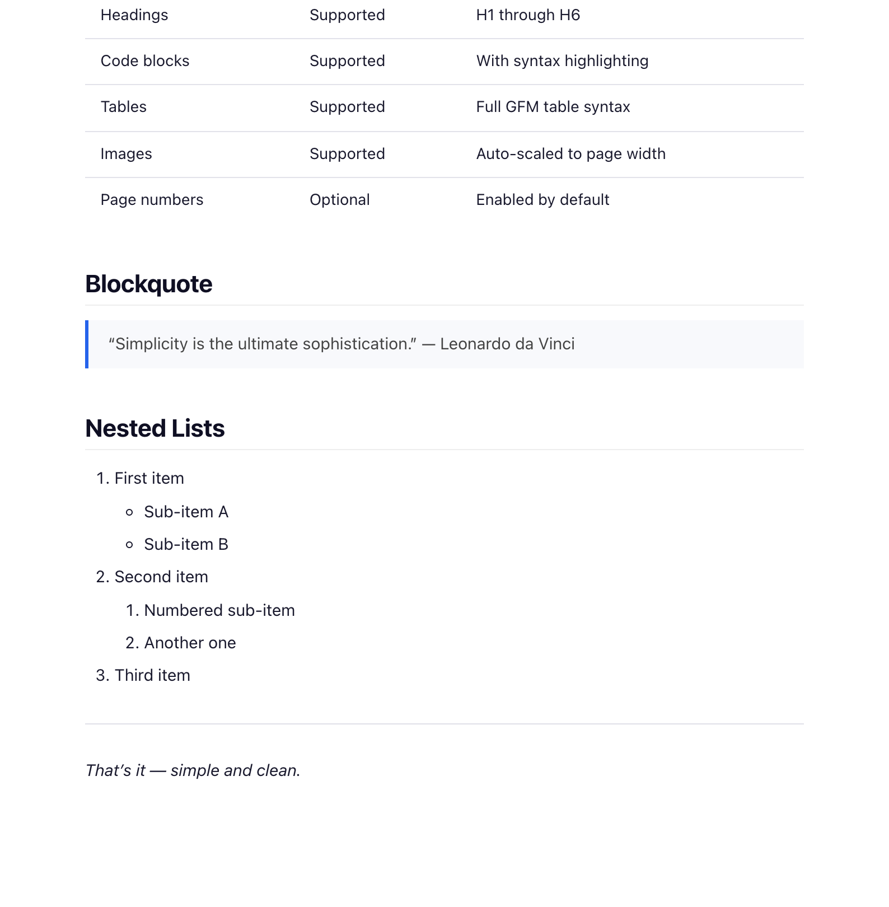

# md2pdf

A command-line tool that converts Markdown files to cleanly styled PDFs.

## Output

Given standard Markdown input, md2pdf produces a PDF with contemporary typography, syntax-highlighted code blocks, and well-formatted tables:

<p align="center">
  
  
</p>

<details>
<summary>View the Markdown source used above</summary>

~~~markdown
# Project Overview

A brief guide to demonstrate the **md2pdf** converter and its styling capabilities.

## Getting Started

To install the tool globally, run:

```bash
npm install -g md2pdf
```

Then convert any Markdown file:

```bash
md2pdf README.md -o output.pdf
```

## Features

- Clean, contemporary typography with Inter font family
- Syntax-highlighted code blocks
- Properly styled tables, blockquotes, and lists
- Configurable page size and margins
- Optional page numbering

## Code Example

Here's a small JavaScript snippet:

```javascript
async function fetchData(url) {
  const response = await fetch(url);
  if (!response.ok) {
    throw new Error(`HTTP ${response.status}`);
  }
  return response.json();
}
```

## Data Table

| Feature          | Status    | Notes                    |
|------------------|-----------|--------------------------|
| Headings         | Supported | H1 through H6            |
| Code blocks      | Supported | With syntax highlighting  |
| Tables           | Supported | Full GFM table syntax     |
| Images           | Supported | Auto-scaled to page width |
| Page numbers     | Optional  | Enabled by default        |

## Blockquote

> "Simplicity is the ultimate sophistication."
> — Leonardo da Vinci

## Nested Lists

1. First item
   - Sub-item A
   - Sub-item B
2. Second item
   1. Numbered sub-item
   2. Another one
3. Third item

---

*That's it — simple and clean.*
~~~

</details>

## Installation

```bash
git clone https://github.com/mo0kid/md2pdf.git
cd md2pdf
npm install
npm link
```

After linking, the `md2pdf` command is available globally.

## Usage

```
md2pdf <input.md> [options]
```

**Examples:**

```bash
# Basic conversion (outputs input.pdf alongside the .md file)
md2pdf notes.md

# Specify output path
md2pdf notes.md -o ~/Documents/notes.pdf

# Use Letter size with wider margins
md2pdf report.md -f Letter -m 3cm -x 2.5cm

# Disable page numbers
md2pdf draft.md --no-page-numbers
```

## Options

| Flag | Description | Default |
|------|-------------|---------|
| `-o, --output <path>` | Output PDF file path | Same as input with `.pdf` extension |
| `-f, --format <size>` | Page size: `A4`, `Letter`, `Legal` | `A4` |
| `-m, --margin <size>` | Top and bottom margin | `2.5cm` |
| `-x, --margin-x <size>` | Left and right margin | `2cm` |
| `--no-page-numbers` | Disable page numbers in footer | Enabled |

## What it supports

- Headings (H1 through H6)
- Bold, italic, and inline code
- Fenced code blocks with syntax highlighting
- Tables (GitHub Flavored Markdown)
- Blockquotes
- Ordered and unordered lists, including nested
- Horizontal rules
- Images (scaled to page width)
- Links

## Use as an MCP server (for Claude)

md2pdf ships a [Model Context Protocol](https://modelcontextprotocol.io)
server that exposes the converter as a tool to Claude Desktop, Claude Code,
and any other MCP-compatible client. Once configured, you can ask Claude
things like *"turn `notes.md` into a PDF"* or *"render this Markdown as a PDF
on my Desktop"* and it will call the converter for you — no need to drop into
a terminal.

After `npm link` (or `npm install -g`), the `md2pdf-mcp` command is available
on your `PATH` and speaks MCP over stdio.

### Tools exposed

| Tool | Use when | Required arguments |
|------|----------|-------------------|
| `convert_file_to_pdf` | The Markdown already exists as a `.md` file on disk | `input_path` |
| `convert_markdown_to_pdf` | The Markdown is in the conversation (just generated, pasted, etc.) | `markdown`, `output_path` |

Both tools accept the same optional formatting arguments:

| Argument | Type | Default | Description |
|----------|------|---------|-------------|
| `format` | `"A4"` \| `"Letter"` \| `"Legal"` | `A4` | Page size |
| `margin` | string | `2.5cm` | Top and bottom margin (e.g. `1in`, `20mm`) |
| `margin_x` | string | `2cm` | Left and right margin |
| `page_numbers` | boolean | `true` | Show `n / total` in the footer |

On success, both tools return a short text result containing the absolute
path of the written PDF.

### Claude Desktop

Add the server to `~/Library/Application Support/Claude/claude_desktop_config.json`
on macOS (or `%APPDATA%\Claude\claude_desktop_config.json` on Windows), then
restart Claude Desktop:

```json
{
  "mcpServers": {
    "md2pdf": {
      "command": "md2pdf-mcp"
    }
  }
}
```

If `md2pdf-mcp` is not on the global `PATH` that Claude Desktop sees (common
when using `nvm`), point at the absolute path instead:

```json
{
  "mcpServers": {
    "md2pdf": {
      "command": "/usr/local/bin/node",
      "args": ["/absolute/path/to/md2pdf/bin/md2pdf-mcp.js"]
    }
  }
}
```

### Claude Code

```bash
claude mcp add md2pdf md2pdf-mcp
```

Verify the server is registered and healthy:

```bash
claude mcp list
```

### Example prompts

Once the server is connected, try prompts like:

- *"Convert `~/Documents/notes.md` to a PDF."*
- *"Render `report.md` as a Letter-sized PDF with 1 inch margins, no page numbers."*
- *"Take the meeting notes you just drafted and save them as a PDF on my Desktop."*

### Under the hood

The MCP server is a thin wrapper around the same `lib/convert.js` used by the
CLI, so output is byte-for-byte identical between the two entry points. PDF
rendering uses Puppeteer (headless Chromium), so the first run after install
may download a Chromium binary.

## Dependencies

- [markdown-it](https://github.com/markdown-it/markdown-it) -- Markdown parser
- [highlight.js](https://highlightjs.org/) -- Syntax highlighting
- [Puppeteer](https://pptr.dev/) -- PDF rendering via headless Chrome

## Support

If you find md2pdf useful and want to say thanks, you can
[buy me a coffee on Ko-fi](https://ko-fi.com/djw_audio) — it genuinely
helps keep side projects like this one alive.

## License

MIT
